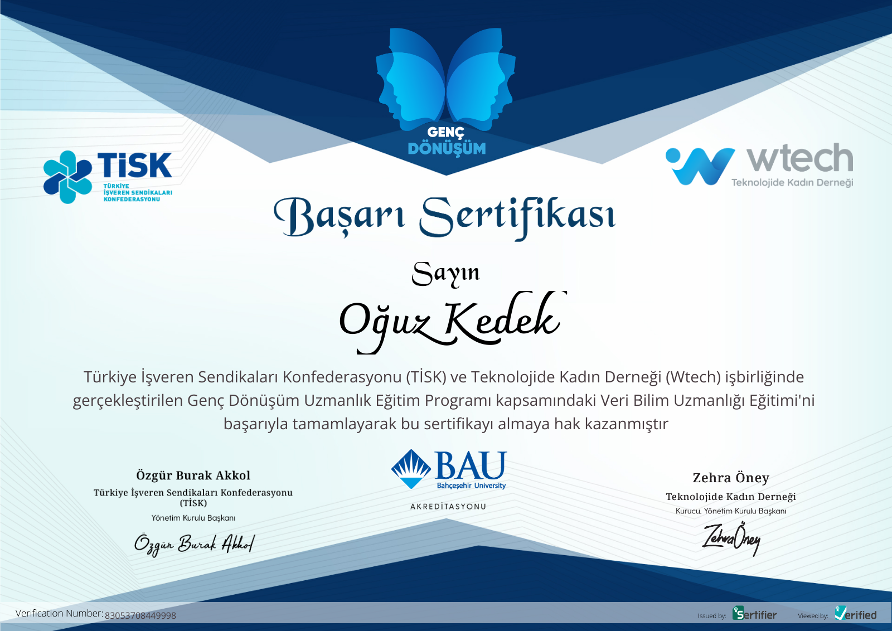

I have successfully completed the Data Science Specialist Bootcamp within the scope of the Youth Transformation Project, which was realized with the cooperation of TİSK and Wtech Academy, with the contributions of Bahçeşehir University.  

In the Boot camp that lasted for 3 months between November 2021 and February 2022, I've studied Python programming, Data Manipulation, Data Visualization, Statistics for Data Science, Exploratory Data Analysis, Feature Engineering, and Machine Learning (classification, regression, clustering algorithms), Introductory Deep Learning.

     

The success certificate can be accessed from the link below.

https://verified.cv/en/verify/83053708449998?ref=email